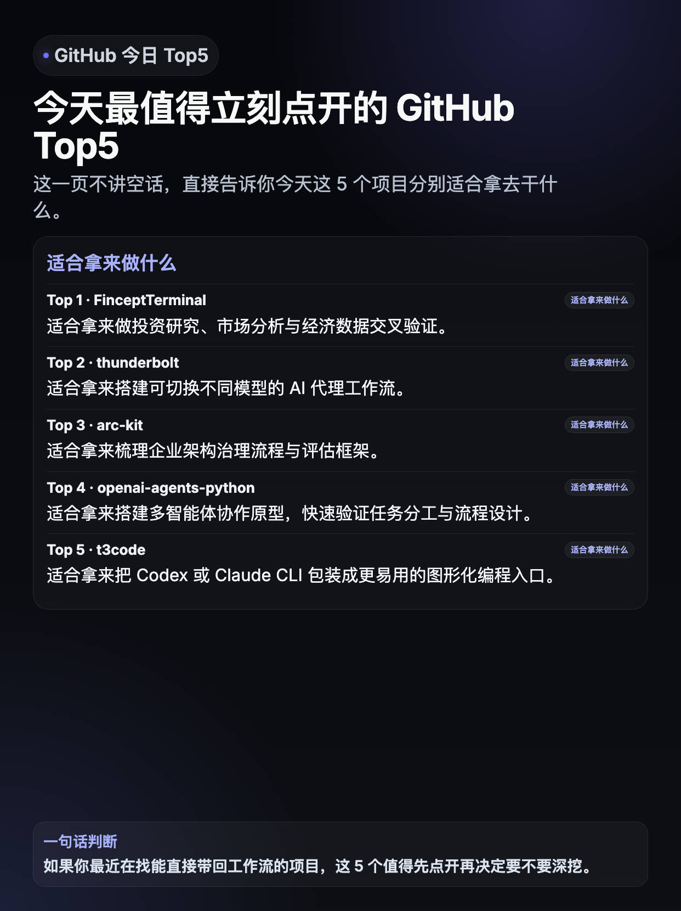
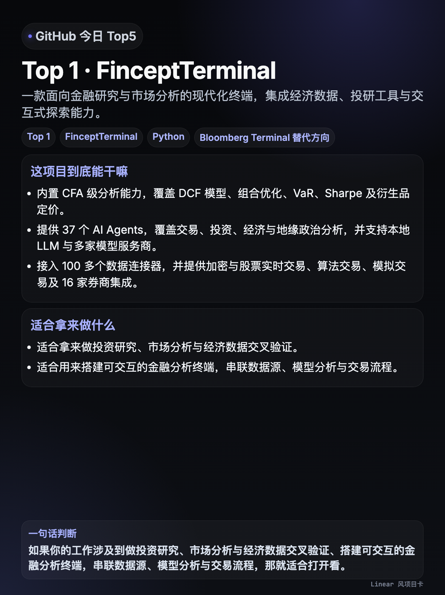
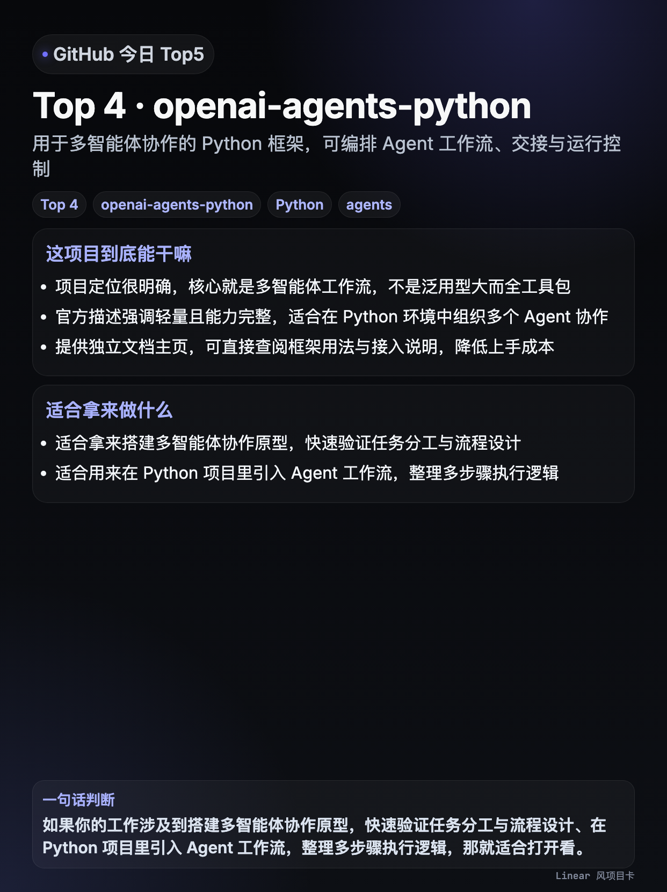

# GitHub Trending Top5 → 中文小红书卡片（暗色 Linear 风）

这是一个把 **GitHub Trending Top5** 自动整理成**中文社交媒体卡片**的 Hermes skill 与脚本示例仓库。

它的目标不是只抓热门项目，而是把当天最值得看的 Top5 用更适合中文平台传播的方式整理出来：

- 先做中文结构化总结
- 再生成固定尺寸 HTML 卡片
- 再用 Playwright 截图导出 PNG
- 最后自动投递到飞书

整套视觉已经定稿为：

- **暗色 Linear 风**
- **封面与项目卡统一风格**
- **优先手机阅读**
- **不依赖模型在图片里直接渲染中文文字**

---

## 示例截图

### 首页封面

### 项目卡示例 1：FinceptTerminal

### 项目卡示例 2：openai-agents-python

---

## 仓库内容

- `SKILL.md`：Hermes skill 说明
- `scripts/generate_trending_xhs.py`：主生成脚本
- `README.md`：中文说明文档

---

## 这个 skill 能做什么

### 内容侧
- 抓 GitHub Trending Top5
- 每个项目单独中文化
- 生成：
  - 一句话看懂
  - 这项目到底能干嘛
  - 适合拿来做什么
  - 一句话判断

### 图片侧
- 生成 `1242 × 1660` 的 3:4 卡片
- 首页只保留最有效的信息结构
- 封面和项目卡统一暗色 Linear 风
- 用 Playwright 导出高清 PNG

### 投递侧
- 自动上传到飞书
- 发送：
  - Markdown
  - HTML
  - 封面图
  - 5 张项目卡

---

## 首页当前定稿结构

首页只保留：

- `GitHub 今日 Top5`
- 主标题
- 一句导语
- `适合拿来做什么`（按 Top1~Top5 逐条列出）
- 一句话判断

明确删除：

- 首页的“这项目到底能干嘛”区块
- 任何 `...` / `…` 截断
- 比例/分辨率等导出元信息

---

## 项目卡当前定稿结构

每张项目卡包含：

- 标题
- 一句话看懂
- tags / chips
- 这项目到底能干嘛
- 适合拿来做什么
- 一句话判断

其中“一句话判断”优先使用这种任务导向句式：

> 如果你的工作涉及到 XXX、XXX、XXX，那就适合打开看。

---

## 为什么不用模型直接做中文图片

因为那条路很容易出现：

- 中文乱码
- 错字
- 版式漂移
- 字体不可控

更稳的方案是：

1. 先输出中文文案
2. 用 HTML 精确排版
3. 用浏览器截图导出图片

---

## 依赖

你至少需要这些环境：

- Python 3
- Playwright / Chromium
- Hermes CLI
- 飞书应用凭证（如果要自动投递飞书）

常见环境变量：

- `FEISHU_APP_ID`
- `FEISHU_APP_SECRET`
- `FEISHU_TARGET_CHAT_ID`

如果没有设置 `FEISHU_TARGET_CHAT_ID`，脚本不会内置任何默认会话 ID；建议你在运行环境中显式传入。

---

## 适合谁用

适合：

- 想做 GitHub Trending 中文盘点的人
- 想做小红书 / 微信 / 飞书内容自动化的人
- 不想让模型直接在图里渲染中文的人
- 想要稳定、可复现、可迭代的卡片生产链路的人

---

## 后续可扩展方向

- 自动归档到飞书云文档
- 自动分发到小红书 / 公众号 / 微信
- 增加历史索引页
- 增加多主题皮肤切换
- 增加封面自动 A/B 测试

---

## 许可

默认按 MIT 风格开放；如果你要正式对外开源，建议补一个标准 `LICENSE` 文件。
